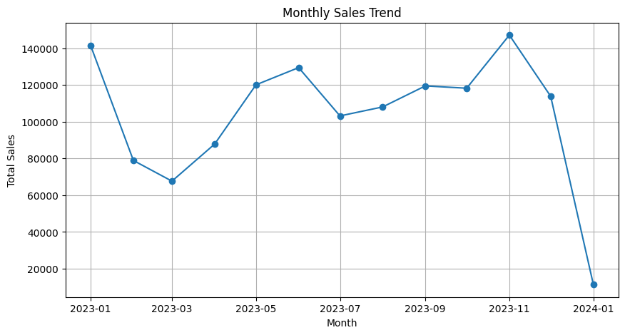
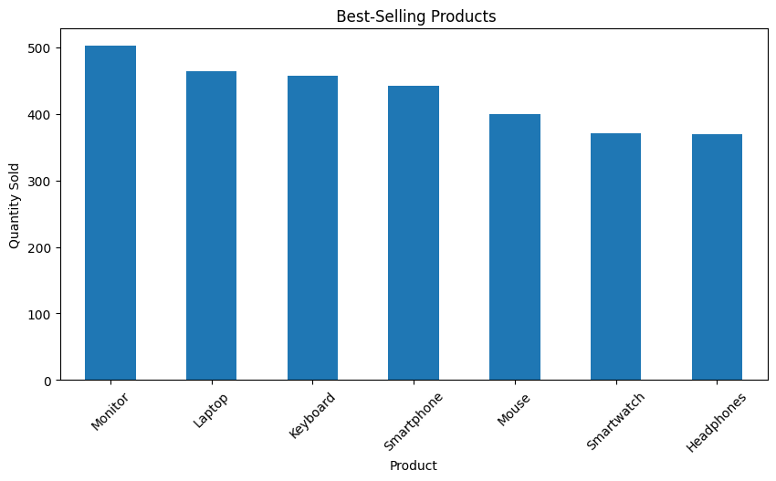
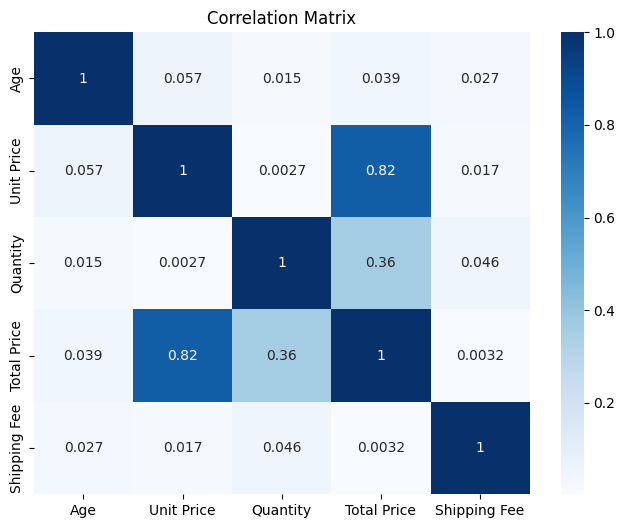
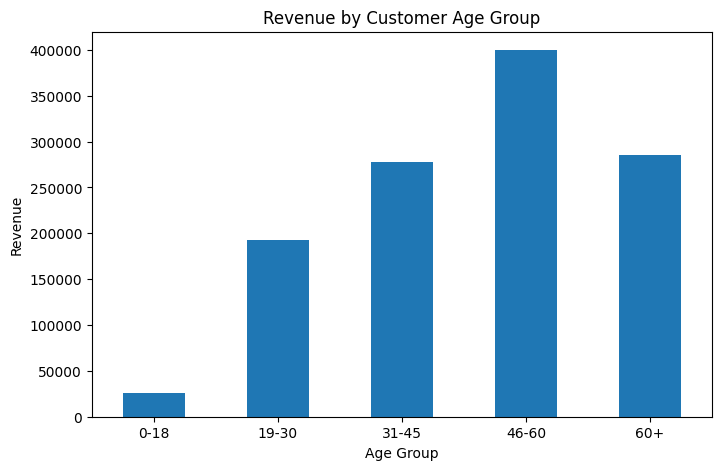

# 📊 Retail Sales Data - Exploratory Data Analysis

## Overview

This project explores a retail sales dataset using Python to identify sales trends, customer demographics, product performance, and business insights through exploratory data analysis (EDA).

---

## Objective

The objective of this project is to:

- Perform data cleaning and initial exploration
- Analyze sales trends over time
- Study customer demographics
- Evaluate product performance
- Generate business recommendations based on data

---

## Tools & Libraries

- Python
- Pandas
- Matplotlib
- Seaborn
- Jupyter Notebook

---

## Dataset

The dataset contains retail transaction records with information such as:

- Order Date
- Customer Age
- Gender
- Product Name
- Product Category
- Quantity
- Unit Price
- Total Price
- Shipping Fee
- Region
- Shipping Status

---

## Analysis Performed

- Dataset inspection
- Missing value analysis
- Descriptive statistics
- Monthly and quarterly sales trend analysis
- Customer age group and gender analysis
- Top-selling products
- Revenue by product category
- Correlation analysis
- Revenue by customer age group

---

## Results

### Monthly Sales Trend



---

### Top Selling Products



---

### Correlation Matrix



---

### Revenue by Customer Age Group



---

## Key Insights

- Customers aged **46–60** generated the highest revenue.
- Best-selling products accounted for a significant portion of overall sales.
- Product categories contributed differently to total revenue.
- Sales trends highlighted periods of higher and lower demand, which can support inventory planning.

---

## Business Recommendations

- Target customers aged **46–60** with personalized marketing campaigns.
- Maintain adequate inventory for best-selling products.
- Allocate more resources to high-performing product categories.
- Use sales trends for demand forecasting and inventory management.
- Introduce more products targeted toward customers aged **46–60** to increase customer engagement and revenue.

---

## Project Structure

```text
DataAnalytics-L1-EDARetailSales/
│
├── Retail_Sales_EDA.ipynb
├── retail_sales_dataset.csv
├── README.md
└── screenshots/
    ├── monthly_sales_trend.png
    ├── correlation_heatmap.png
    ├── top_products.png
    └── revenue_by_age_group.png
```

---

## Author

**Pranav VVS**

