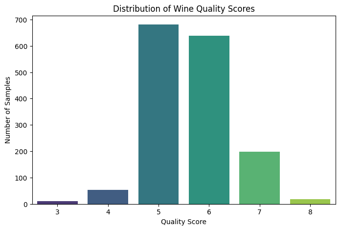
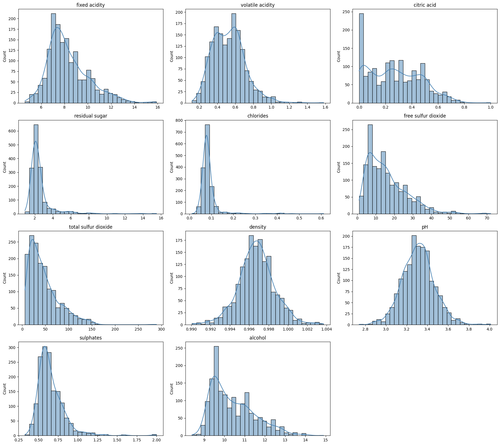
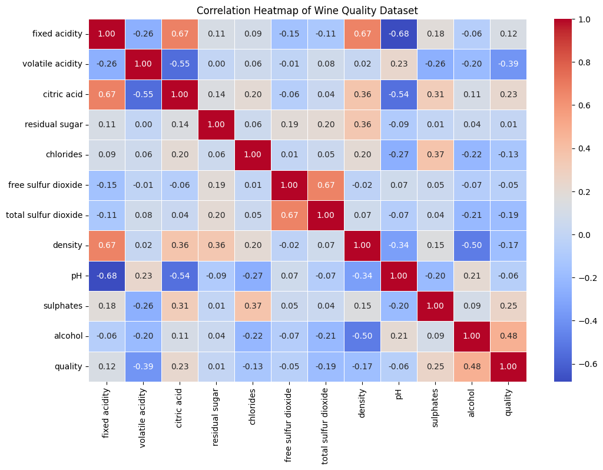
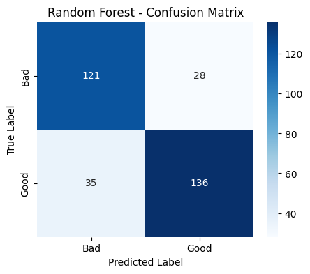
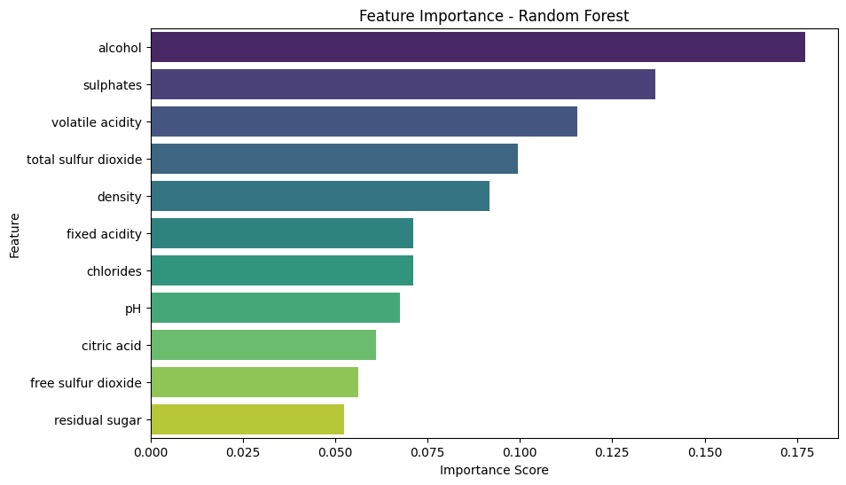
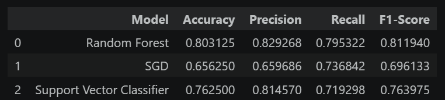

# Wine Quality Prediction

## Overview

This project develops and compares multiple machine learning classification models to predict wine quality based on its physicochemical properties. The original wine quality scores were transformed into a binary classification problem (Good/Bad) to address class imbalance and improve model performance.

The project follows a complete machine learning workflow, including data preprocessing, exploratory data analysis (EDA), feature engineering, model training, evaluation, and performance comparison.

---

## Objectives

- Analyze the Wine Quality dataset through exploratory data analysis.
- Identify class imbalance in the target variable.
- Perform feature engineering by converting quality scores into binary classes.
- Train multiple machine learning classifiers.
- Compare model performance using standard evaluation metrics.
- Identify the most suitable model for deployment.

---

## Dataset

- **Dataset:** Wine Quality Dataset (Red Wine)
- **Source:** UCI Machine Learning Repository
- **Records:** 1,599
- **Features:** 11 physicochemical attributes
- **Target Variable:** Wine Quality

### Features

- Fixed Acidity
- Volatile Acidity
- Citric Acid
- Residual Sugar
- Chlorides
- Free Sulfur Dioxide
- Total Sulfur Dioxide
- Density
- pH
- Sulphates
- Alcohol

---

## Technologies Used

- Python
- Pandas
- NumPy
- Matplotlib
- Seaborn
- Scikit-learn
- Jupyter Notebook

---

## Project Workflow

1. Data Loading and Inspection
2. Exploratory Data Analysis (EDA)
3. Class Imbalance Analysis
4. Feature Engineering
5. Train-Test Split with Stratification
6. Feature Scaling
7. Model Training
8. Model Evaluation
9. Feature Importance Analysis
10. Model Performance Comparison
11. Conclusion

---

## Machine Learning Models

The following classifiers were implemented and evaluated:

- Random Forest Classifier
- Stochastic Gradient Descent (SGD) Classifier
- Support Vector Classifier (SVC)

---

## Evaluation Metrics

The models were evaluated using:

- Accuracy
- Precision
- Recall
- F1-Score
- Classification Report
- Confusion Matrix

---

## Results

| Model | Accuracy | Precision | Recall | F1-Score |
|-------|---------:|----------:|-------:|---------:|
| Random Forest | 0.8031 | 0.8293 | 0.7953 | 0.8119 |
| SGD | 0.7313 | 0.7833 | 0.7009 | 0.7399 |
| Support Vector Classifier | 0.7750 | 0.8052 | 0.7674 | 0.7859 |

The Random Forest classifier achieved the best overall performance across all evaluation metrics and was selected as the most suitable model for deployment.

---

## Project Visualizations

### Class Distribution



---

### Feature Distributions



---

### Correlation Heatmap



---

### Random Forest Confusion Matrix



---

### Feature Importance



---

### Model Comparison



---

## Repository Structure

```text
Wine-Quality-Prediction/
│
├── data/
│   └── winequality-red.csv
│
├── notebooks/
│   └── Wine_Quality_Prediction_Level_2.ipynb
│
├── screenshots/
│   ├── class_distribution.png
│   ├── correlation_heatmap.png
│   ├── feature_distributions.png
│   ├── feature_importance.png
│   ├── model_comparison.png
│   └── random_forest_confusion_matrix.png
│
├── README.md
└── requirements.txt
```

---

## Key Findings

- The dataset exhibited class imbalance, with quality scores 5 and 6 dominating the distribution.
- Converting the target variable into binary classes improved class balance and simplified the classification task.
- Alcohol, volatile acidity, sulphates, and total sulfur dioxide were identified as the most influential predictors of wine quality.
- Random Forest consistently outperformed SGD and SVC in terms of accuracy, precision, recall, and F1-score.

---

## Conclusion

Among the evaluated classifiers, the Random Forest model demonstrated the highest predictive performance while maintaining strong interpretability through feature importance analysis. Its balanced performance across all evaluation metrics makes it the most suitable model for binary wine quality prediction.
